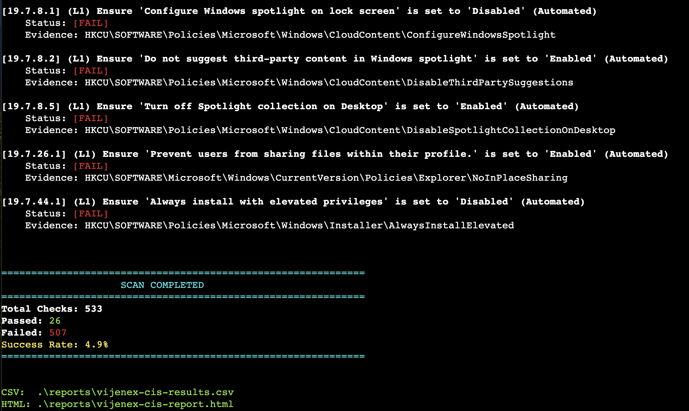
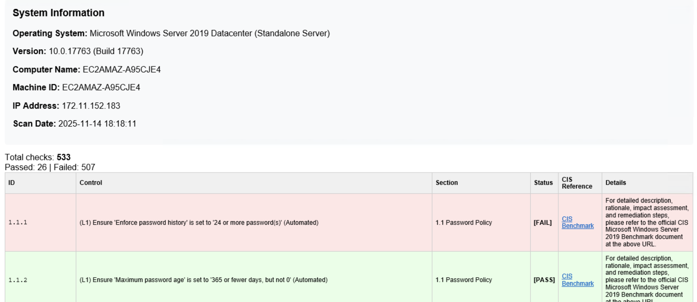

```
██╗   ██╗██╗     ██╗███████╗███╗   ██╗███████╗██╗  ██╗
██║   ██║██║     ██║██╔════╝████╗  ██║██╔════╝╚██╗██╔╝
██║   ██║██║     ██║█████╗  ██╔██╗ ██║█████╗   ╚███╔╝ 
╚██╗ ██╔╝██║██   ██║██╔══╝  ██║╚██╗██║██╔══╝   ██╔██╗ 
 ╚████╔╝ ██║╚█████╔╝███████╗██║ ╚████║███████╗██╔╝ ██╗
  ╚═══╝  ╚═╝ ╚════╝ ╚══════╝╚═╝  ╚═══╝╚══════╝╚═╝  ╚═╝

                    Windows CIS Audit Tool
           Powered by Vijenex Security Platform
```

# Windows CIS Audit Platform

A comprehensive PowerShell-based security auditing platform for Windows systems based on official Center for Internet Security (CIS) benchmarks. Supports multiple Windows versions with dedicated audit modules.

## 🔓 **OPEN SOURCE SOFTWARE**
This repository contains open source software under MIT License. **CONTRIBUTIONS WELCOME**. See [LICENSE](LICENSE) for full terms.

## 📋 Overview

This platform provides automated security compliance auditing for Windows systems against official CIS (Center for Internet Security) benchmarks. It performs comprehensive security assessments without making any system changes - **audit-only mode**.


### ✨ Key Features

- **🔍 Multi-Version Support**: Dedicated modules for different Windows versions (2025, 2022, 2019, etc.)
- **📋 Official CIS Compliance**: Strictly follows official CIS benchmark documentation
- **🛡️ Multiple Rule Types**: Supports SecEdit, AuditPolicy, User Rights Assignment, Registry, and Manual checks
- **📊 Detailed Reporting**: Generates HTML and CSV reports with remediation guidance
- **🚫 Audit-Only**: No system modifications - safe to run in production
- **⚡ Automated**: Minimal user interaction required
- **📖 Documentation**: Includes official CIS benchmark documentation for each version

### 🎯 Supported Rule Types

| Type | Description | Coverage |
|------|-------------|----------|
| **SecEdit** | Security policy settings via secedit export | Password policies, Account lockout, Security options |
| **AuditPolicy** | Advanced audit policy configuration | Event logging and monitoring |
| **PrivRight** | User Rights Assignment automation | Privilege and logon rights |
| **Registry** | Administrative Templates via registry | Group Policy settings |
| **Composite** | Multi-condition validation | Complex policy combinations |
| **Manual** | Human verification required | Firewall, services, and UI settings |

## 🗂️ Repository Structure

```
├── windows-2025/           # Windows Server 2025 CIS audit tools (COMPLETE)
│   ├── Scripts/
│   │   └── mother-scanner.ps1    # Main scanner engine
│   ├── milestones/               # CIS control definitions
│   │   ├── milestone-1.ps1       # Account Policies
│   │   ├── milestone-2.ps1       # Local Policies  
│   │   ├── milestone-5.ps1       # System Services
│   │   ├── milestone-9.ps1       # Windows Defender Firewall
│   │   ├── milestone-17.ps1      # Advanced Audit Policy
│   │   ├── milestone-18.ps1      # Administrative Templates (Computer)
│   │   ├── milestone-19.ps1      # Administrative Templates (User)
│   │   └── ...                   # Additional milestones
│   ├── documentation/            # Official CIS benchmark PDF
│   └── reports/                  # Generated audit reports
├── windows-2019/           # Windows Server 2019 CIS audit tools (COMPLETE)
│   ├── Scripts/
│   │   └── mother-scanner.ps1    # Main scanner engine
│   ├── milestones/               # CIS control definitions (431 controls)
│   │   ├── milestone-1.ps1       # Account Policies
│   │   ├── milestone-2.ps1       # Local Policies
│   │   ├── milestone-5.ps1       # System Services
│   │   ├── milestone-9.ps1       # Windows Defender Firewall
│   │   ├── milestone-17.ps1      # Advanced Audit Policy
│   │   ├── milestone-18.ps1      # Administrative Templates (Computer)
│   │   ├── milestone-19.ps1      # Administrative Templates (User)
│   │   └── ...                   # Additional milestones
│   ├── documentation/            # CIS benchmark documentation
│   └── reports/                  # Generated audit reports
├── windows-2022/           # [Planned] Windows Server 2022 tools
├── windows-11/             # [Planned] Windows 11 tools
├── windows-10/             # [Planned] Windows 10 tools
└── LICENSE                 # MIT License
```

## 🚀 Quick Start

### Prerequisites
- Supported Windows system (see version-specific folders)
- PowerShell 5.1 or later
- **Administrator privileges** (required for security policy access)

### Installation

#### System Installation (Recommended)

**Latest Release (Stable):**
```powershell
# Download latest release (v2.1.2)
Invoke-WebRequest -Uri "https://github.com/vijenex/windows-cis-scanner/archive/refs/tags/v2.1.2.zip" -OutFile "vijenex-windows-cis-v2.1.2.zip"
Expand-Archive -Path "vijenex-windows-cis-v2.1.2.zip" -DestinationPath "C:\Tools\"
cd "C:\Tools\Windows-Server-CIS-Audit-2.1.2\windows-2025"

# Or for Windows Server 2019
cd "C:\Tools\Windows-Server-CIS-Audit-2.1.2\windows-2019"
```

**Development Version:**
```powershell
# Clone the repository
git clone https://github.com/vijenex/windows-cis-scanner.git
cd windows-cis-scanner

# Navigate to your Windows version
cd windows-2025  # For Windows Server 2025
# OR
cd windows-2019  # For Windows Server 2019
```

**Specific Version:**
```powershell
# Install specific version (replace v2.1.2 with desired version)
git clone --branch v2.1.2 https://github.com/vijenex/windows-cis-scanner.git
cd windows-cis-scanner\windows-2025  # or windows-2019
```

### Usage

#### Basic Scan (All Controls)
```powershell
# Navigate to your Windows version folder (e.g., windows-2025)
cd windows-2025

# Run comprehensive CIS audit (HTML + CSV by default)
powershell -NoProfile -ExecutionPolicy Bypass -File .\Scripts\mother-scanner.ps1 -OutputDir .\reports -Profile Level1

# Generate all formats (HTML, CSV, PDF, Word)
powershell -NoProfile -ExecutionPolicy Bypass -File .\Scripts\mother-scanner.ps1 -OutputDir .\reports -Profile Level1 -OutputFormat All
```

### Scanner in Action

**Scan Process:**


**Scan Output with Summary:**


#### Advanced Options
```powershell
# From within version-specific folder (e.g., windows-2025)

# Generate only Word document
powershell -NoProfile -ExecutionPolicy Bypass -File .\Scripts\mother-scanner.ps1 -OutputFormat Word -OutputDir .\reports

# Generate only PDF report
powershell -NoProfile -ExecutionPolicy Bypass -File .\Scripts\mother-scanner.ps1 -OutputFormat PDF -OutputDir .\reports

# Generate multiple formats
powershell -NoProfile -ExecutionPolicy Bypass -File .\Scripts\mother-scanner.ps1 -OutputFormat HTML,PDF,Word -OutputDir .\reports

# Scan specific milestones with Word output
powershell -NoProfile -ExecutionPolicy Bypass -File .\Scripts\mother-scanner.ps1 -Milestones @("milestone-1.ps1","milestone-2.ps1") -OutputFormat Word -OutputDir .\reports

# Include specific controls with all formats
powershell -NoProfile -ExecutionPolicy Bypass -File .\Scripts\mother-scanner.ps1 -Include @("1.1.1","2.2.1") -OutputFormat All -OutputDir .\reports
```

### Parameters

| Parameter | Description | Default | Example |
|-----------|-------------|---------|---------|
| `-OutputDir` | Report output directory | `.\reports` | `-OutputDir "C:\Audit"` |
| `-Profile` | CIS profile level | `Level1` | `-Profile Level2` |
| `-OutputFormat` | Report formats to generate | `HTML,CSV` | `-OutputFormat All` or `-OutputFormat Word,PDF` |
| `-Milestones` | Specific milestone files | All files | `-Milestones @("milestone-1.ps1")` |
| `-Include` | Include specific control IDs | None | `-Include @("1.1.1","2.2.1")` |
| `-Exclude` | Exclude specific control IDs | None | `-Exclude @("9.2.1")` |

## 📊 Report Output

The tool generates comprehensive reports in multiple formats with detailed system information:

### Sample HTML Report


### Scan Summary Display


### 📄 HTML Report (`vijenex-cis-report.html`)
- **System Information**: OS version, IP address, machine ID, scan date
- **Visual dashboard** with pass/fail summary
- **Detailed findings** with CIS Reference links
- **Remediation guidance** for each control
- **Color-coded results** for easy identification (green for pass, red for fail)


### 📈 CSV Report (`vijenex-cis-results.csv`)
- **Structured data** for analysis and tracking
- **Import-friendly** format for spreadsheet applications
- **Compliance tracking** over time

### 📑 PDF Report (`vijenex-cis-report-pdf.html`)
- **Browser-based PDF generation** (no additional software needed)
- **Print-friendly HTML** with one-click PDF creation button
- **Clean format** for executive reporting
- **Complete system information** and audit results
- **Usage**: Open in browser → Click "Print to PDF" button → Save as PDF

### 📝 Word Document (`vijenex-cis-report.docx`)
- **Native DOCX format** - Word document
- **Requires Microsoft Word** for generation
- **Structured tables** with all audit findings
- **System details** for audit trail
- **Usage**: Opens directly in Microsoft Word

### 🎯 Output Format Options
- `HTML,CSV` (default)
- `All` (HTML + CSV + PDF + Word)
- `Word` (Word document only)
- `PDF` (PDF report only)
- `HTML,PDF,Word` (custom combination)

### 📚 CIS Documentation
- **Official CIS benchmark guide** included with reports
- **Detailed remediation steps** for each control
- **Best practice recommendations**

## 🎯 CIS Coverage

### Currently Supported Versions

#### Windows Server 2025 Standalone/Workgroup

| Section | Controls | Coverage |
|---------|----------|----------|
| **1** Account Policies | 11 | Password Policy, Account Lockout Policy |
| **2** Local Policies | 98 | User Rights Assignment, Security Options |
| **5** System Services | 1 | Print Spooler configuration |
| **9** Windows Defender Firewall | 14 | Private/Public profile settings |
| **17** Advanced Audit Policy | 27 | Comprehensive audit logging |
| **18** Administrative Templates (Computer) | 164+ | Registry-based security settings |
| **19** Administrative Templates (User) | 12 | User configuration policies |

**Total: 327+ Security Controls**

#### Windows Server 2019 Standalone/Workgroup ✅ **NEW**

| Section | Controls | Coverage |
|---------|----------|----------|
| **1** Account Policies | 10 | Password Policy, Account Lockout Policy |
| **2** Local Policies | 95 | User Rights Assignment, Security Options |
| **5** System Services | 2 | Print Spooler, Remote Registry |
| **9** Windows Defender Firewall | 27 | Domain, Private, Public profiles |
| **17** Advanced Audit Policy | 54 | Comprehensive audit logging |
| **18** Administrative Templates (Computer) | 230+ | Registry-based security settings |
| **19** Administrative Templates (User) | 13 | User configuration policies |

**Total: 533 Security Controls Evaluated** (Level1 profile)
**Unique Control Definitions: 431** (57% of 751 total CIS controls)

### Planned Versions

- **Windows Server 2022** - Coming soon
- **Windows 11** - Planned
- **Windows 10** - Planned

> All implementations strictly follow official CIS benchmark documentation for each respective version.

## 🔧 Understanding Results

### Result Status
- ✅ **Pass**: Control is properly configured
- ❌ **Fail**: Control needs attention or manual verification
- ⚠️ **Manual**: Requires human verification (not a failure)

### Common "Fail" Reasons
1. **Default Windows Settings**: Fresh installations lack security hardening
2. **Manual Verification Required**: Firewall, services, UI settings need human check
3. **Missing Group Policy**: Administrative Templates require GP configuration
4. **Audit Policy Disabled**: Windows default has minimal audit logging

## 🛠️ Troubleshooting

### Common Issues

#### "Access Denied" Errors
```powershell
# Ensure running as Administrator
# Right-click PowerShell → "Run as Administrator"
```

#### "Execution Policy" Errors
```powershell
# Temporarily bypass execution policy
Set-ExecutionPolicy -ExecutionPolicy Bypass -Scope Process
```

#### "No Rules Loaded" 
- Verify milestone files exist in `milestones/` folder
- Check file permissions and paths
- Ensure PowerShell syntax is valid

#### High Failure Rate
- **Expected behavior** for default Windows installations
- Use reports to identify actual security gaps
- Focus on "Pass" vs "Manual" vs genuine "Fail" items

## 📋 Best Practices

### Before Running
1. **Backup system** (recommended for production)
2. **Review scope** - start with specific milestones
3. **Plan remediation** - have change management process ready

### After Running  
1. **Review HTML report** for executive summary
2. **Analyze CSV data** for detailed findings
3. **Prioritize fixes** based on risk and impact
4. **Document exceptions** for accepted risks
5. **Schedule regular scans** for compliance monitoring

## 🤝 Contributing

### ✅ Code Contributions
**WELCOME** - This is open source software under MIT License. See [LICENSE](LICENSE) for details.

### 🐛 Issue Reporting
We welcome issue reports and feature requests:

1. **Search existing issues** before creating new ones
2. **Use issue templates** when available  
3. **Provide detailed information**:
   - Windows version and build
   - PowerShell version
   - Error messages (full text)
   - Steps to reproduce
   - Expected vs actual behavior

### 📝 Issue Guidelines
- **Security vulnerabilities**: Contact maintainers privately
- **Feature requests**: Describe use case and business value
- **Bug reports**: Include system information and logs
- **Questions**: Check documentation first

## 📞 Support

- **Issues**: Use GitHub Issues for bug reports and feature requests
- **Documentation**: Refer to included CIS benchmark guide
- **Updates**: Watch repository for new releases

## ⚖️ Legal

### License
This software is open source under MIT License. See [LICENSE](LICENSE) for complete terms.

### Disclaimer
- **No warranty** provided - use at your own risk
- **Audit-only tool** - makes no system changes
- **CIS compliance** - based on official CIS benchmarks
- **Your responsibility** - validate findings in your environment

### CIS Benchmarks
This tool implements controls from CIS (Center for Internet Security) benchmarks. CIS benchmarks are developed by cybersecurity experts and are freely available at [cisecurity.org](https://www.cisecurity.org/).

---

## 🏷️ Releases

### Current Stable Release
- **v2.1.2** - Windows Server 2025 & 2019 CIS Scanner
  - **Windows Server 2025**: 327+ controls implemented
  - **Windows Server 2019**: 533 controls evaluated (431 unique definitions, 57% CIS coverage)
  - Real-time scan progress display with pass/fail summary
  - Multiple report formats (HTML, CSV, PDF, Word)
  - Standardized format across both versions
  - Enhanced security with path validation
  - Comprehensive audit logging

### Download Options
```powershell
# Latest stable release (v2.1.2)
Invoke-WebRequest -Uri "https://github.com/vijenex/windows-cis-scanner/archive/refs/tags/v2.1.2.zip" -OutFile "vijenex-windows-cis-v2.1.2.zip"

# All releases
# Visit: https://github.com/vijenex/windows-cis-scanner/releases
```

### Version Information
- **Current Version**: v2.1.2
- **Supported OS**: Windows Server 2025, Windows Server 2019
- **CIS Compliance**: Based on official CIS benchmark documentation
- **Release Date**: November 2024
- **New Features**: Scan summary display, standardized format, improved reporting

---

**⭐ If this tool helps secure your environment, please star the repository!**

**🔓 Remember: This is open source software under MIT License - contributions welcome!**